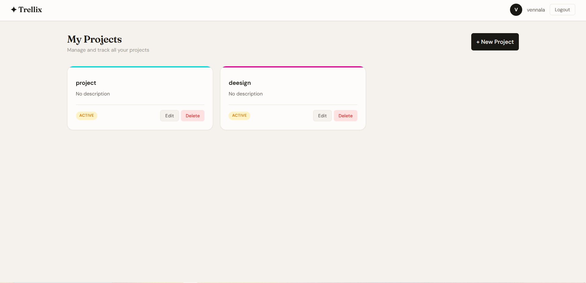
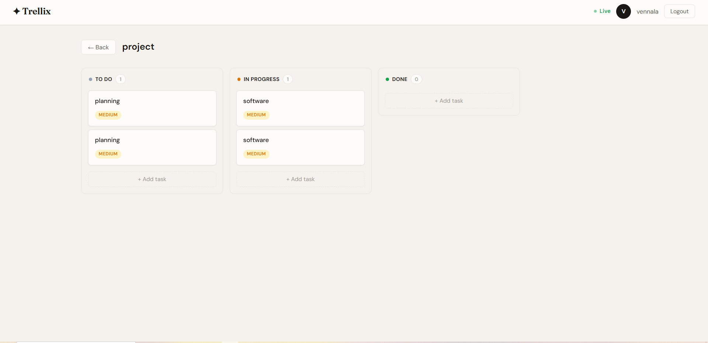

# Trellix — Project Management Tool

A Kanban-based project management app I built as part of my CodeAlpha internship. 
You can create projects, add tasks, track progress and leave comments — 
all updating live without refreshing the page.

---

## Screenshots




---

## Why I built this

I wanted to build something that uses a full stack end to end — login system, 
REST API, database, real-time updates and a working UI. A project management 
tool felt like the right pick because it covers all of that in one project.

---

## Features

- Register and login with your own account
- Create and manage multiple projects
- Kanban board — Todo, In Progress, Done
- Add and delete tasks with title and description
- Comment on tasks
- Real-time board updates using Socket.io
- Clean responsive UI

---

## Tech Stack

**Backend**
- Node.js + Express
- MongoDB + Mongoose
- Socket.io
- JWT authentication
- bcryptjs for password hashing

**Frontend**
- HTML, CSS, Vanilla JavaScript
- Socket.io client
- Fetch API

No frontend framework — I wanted to understand the basics 
before jumping into React or Vue.

---

## Folder Structure
```
trellix/
├── backend/
│   ├── config/
│   │   └── db.js
│   ├── controllers/
│   │   ├── authController.js
│   │   ├── projectController.js
│   │   ├── taskController.js
│   │   └── commentController.js
│   ├── middleware/
│   │   └── auth.js
│   ├── models/
│   │   ├── User.js
│   │   ├── Project.js
│   │   ├── Task.js
│   │   └── Comment.js
│   ├── routes/
│   │   ├── authRoutes.js
│   │   ├── projectRoutes.js
│   │   ├── taskRoutes.js
│   │   └── commentRoutes.js
│   ├── socket/
│   │   └── socket.js
│   ├── .env.example
│   └── server.js
└── frontend/
    ├── css/
    │   └── style.css
    ├── js/
    │   ├── api.js
    │   ├── auth.js
    │   ├── dashboard.js
    │   ├── project.js
    │   └── socket.js
    ├── index.html
    ├── login.html
    ├── register.html
    ├── dashboard.html
    └── project.html
```

---

## Getting Started

### What you need
- Node.js (v18+)
- MongoDB
- VS Code with Live Server extension

### Steps

**1. Clone the repo**
```bash
git clone https://github.com/venug2762-png/CodeAlpha_project-management-tool.git
cd CodeAlpha_project-management-tool
```

**2. Install dependencies**
```bash
cd backend
npm install
```

**3. Set up environment variables**

Create a `.env` file inside the `backend/` folder:
```env
PORT=5000
MONGO_URI=mongodb://localhost:27017/trellix
JWT_SECRET=your_secret_key_here
```

**4. Start MongoDB**

Windows:
```bash
net start MongoDB
```
Mac/Linux:
```bash
mongod
```

**5. Run the backend**
```bash
npm run dev
```

Terminal should show:
```
Server running on port 5000
MongoDB Connected: localhost
```

**6. Open the frontend**

In VS Code right-click `frontend/login.html` → Open with Live Server

App opens at `http://127.0.0.1:5500/login.html`

---

## How to Use

1. Go to `/register.html` and create an account
2. Login at `/login.html`
3. You land on the dashboard — click **New Project** to create one
4. Click a project to open the Kanban board
5. Click **+ Add Task** under any column to add a task
6. Click a task card to view details, change status or add comments
7. Tasks move between columns as you update their status

---

## Note

- The `.env` file is not uploaded to GitHub — your credentials stay private
- MongoDB runs locally so your data is only on your machine
- Anyone who clones this needs to set up their own `.env` and MongoDB

---

## Author

**Venu Gopal Varma**  
GitHub: [@venug2762-png](https://github.com/venug2762-png)

---

*Built as part of CodeAlpha Internship — 2025*
